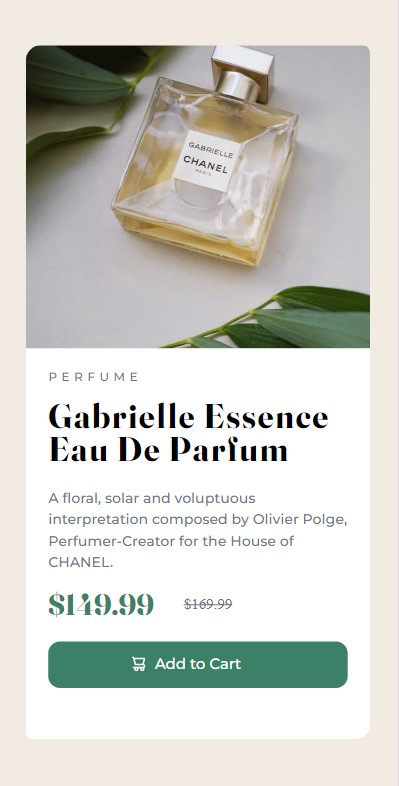

# Product Preview Card

This project is a simple web application of a product preview card. The project was developed using HTML and CSS and published using GitHub Pages.

Front End Mentor - Product preview card component Solution
This is a solution to the Product preview card component issue in Frontend Mentor. Frontend Mentor challenges help you improve your coding skills by creating realistic projects.

Contents

- [Project URL](#project-urls)
- [Features](#features)
- [Project Content](#project-content)
- [Screenshot](#screenshot)
- [Challenge](#challenge)
- [Technologies-Used](#technologies-Used)
- [Author](#author)
- [Licence](#licence)
- [Show-Your-Support](#show-your-support)

# Project URL

The project is published at: [Product preview card component](https://mkalkandev.github.io/Product-preview-card-component/)

# Features

- **Responsive Design:** Provides a good user experience on all devices.
- **Simple and User-Friendly Interface:** Provides easy access to recipe information.

- **Modern HTML and CSS Techniques:** Clean and maintainable code structure.

# Project Content

This project contains the following files and folders:

- **index.html:** HTML file of the home page.

- **style.css:** CSS file that creates the design of the project.

- **images/**: The folder containing the images used on the page.

# Screenshot

# Challenge

My app allows users to:

View the optimal layout for the app based on their device's screen size
See navigation states for all interactive elements on the page
ongoing development
This was my fifth project involving HTML and CSS and I'm happy with the result. This time I tried to learn new things, so I tried to structure HTML better and used flex and grid in CSS. I also gave a little introduction to Responsive design.

I plan to continue exploring and learning more about this technology, so there will definitely be more projects related to it soon.

# Technologies Used

Operating System

Beginning phase

 

tools

 

# Author

👤MustafaKalkan

Github:<a href="https://github.com/mkalkandev/" target="_blank">@mkalkandev</a>

Front End Mentor:<a href="https://www.frontendmentor.io/profile/mkalkandev" target="_blank">@mkalkandev</a>

# Licence

📝 Copyright © 2024 MustafaKalkan.

This project is licensed by [MIT](./LICENSE).

# Show your support

Give a ⭐️ if this project was helpful to you! Have fun building! 🚀
